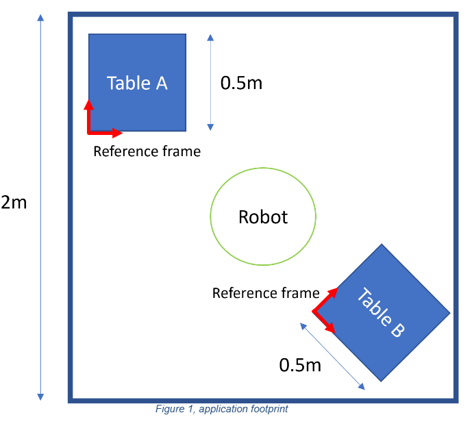

# Robot Pick and Place Simulation Exercise

## Overview

A client is looking for a pick and place solution using a gantry (3-axis) robot. The company is asking you to do a proof of concept.

The solution must:
- Pick a workpiece (cube) from table A and place it on table B
- Table A and Table B can be placed anywhere in the footprint shown in Figure 1

You will implement:
1. A Python server that manages a 'pick and place' program using the provided `robot_sim.py`
2. A React GUI that displays robot information and allows control of the simulation



*Figure 1: Application footprint showing the workspace where tables A and B can be placed*

## Objectives

- Implement a Python server that interfaces with the robot simulation
- Create a React GUI for visualizing and controlling the robot
- Implement the pick-and-place operation logic
- Allow users to configure robot and cube positions
- Display real-time robot position updates

## Technical Requirements

### Backend (Python)

- Python 3.10+ 
- Framework: **FastAPI** (required for state machine integration)
- **Vention State Machine Library**: You must use [`vention-state-machine`](https://pypi.org/project/vention-state-machine/0.3.1/) to manage the robot's state machine
- The provided `robot_sim.py` must be used for robot control
- API endpoints to:
  - Get current robot position
  - Set robot starting position
  - Set cube starting position (table A)
  - Set cube destination position (table B / drop zone)
  - Set robot home position
  - Move robot to home position
  - Start pick-and-place operation
  - Get robot status (position, gripper state, etc.)
  - State machine endpoints (via FastAPI router integration)

### Frontend (TypeScript React)

- Node.js 16+ and npm
- React with TypeScript
- Display the following information :
  - Starting position of the cube (X, Y, Z coordinates)
  - Destination of the cube / drop zone (X, Y, Z coordinates)
  - Current robot position (X, Y, Z coordinates) - update frequency of your choice
  - Show robot status (gripper state, motion status)
  - Show application state machine current state
- Allow user to control:
  - Robot's starting position (starting configuration of robot positions)
  - Cube's starting position (X, Y, Z)
  - Cube's destination (X, Y, Z)
  - Move the robot to a configurable Home position
  - Start the 'pick and place' operation


 **UI/UX Considerations**
   - Clear, intuitive interface
   - Real-time position updates
   - Visual indication of robot state
   - Error message display

## Setup Instructions

### Backend Setup

```bash
cd backend
python -m venv venv
source venv/bin/activate  # On Windows: venv\Scripts\activate
pip install -r requirements.txt
```

The `requirements.txt` file already includes:
- `vention-state-machine==0.3.1` - State machine framework for managing robot operations
- `fastapi` - Web framework for building the API
- `uvicorn[standard]` - ASGI server for running FastAPI
- `vention-storage==0.5.4` - Storage framework for persistent data (bonus feature)

*Note* : It's important to use the targeted version for `vention-state-machine` and `vention-storage` and not the latest. 

### Frontend Setup

```bash
cd frontend
npm install
npm run dev
```

## Exercise Details

### Pick and Place Logic

Implement the pick-and-place sequence:

1. Move robot to cube position (above table A)
2. Lower to pick height (consider a safe pick height, e.g., Z = cube Z position)
3. Close gripper
4. Lift to safe clearance height
5. Move to destination position (above table B)
6. Lower to place height
7. Open gripper
8. Lift to safe clearance height
9. Optionally return to home position


## Robot Simulation Details

The `robot_sim.py` file provides:

- `Robot` class with methods:
  - `move_to(target_position, speed)` - Move robot to target position
  - `move_home(speed)` - Move robot to home position
  - `closed_gripper()` - Close gripper
  - `open_gripper()` - Open gripper
  - Properties: `current_position`, `home_position`, `gripper_state`

**Important**: The `move_to` method must be called repeatedly until motion is completed (it returns the current position and motion status). You should integrate this with your state machine's `@on_enter_state` callbacks to handle motion completion.


## Evaluation Criteria

- Code quality and organization
- Functionality and correctness of pick-and-place operation
- API design and error handling
- Frontend usability and real-time updates
- Testing (unit tests for backend, component tests for frontend)
- Documentation
- Best practices adherence

## Submission Guidelines

1. **Fork this repository** and complete the exercise in your fork
2. **Document your work** in this folder:
   - How to set up and run the backend
   - How to set up and run the frontend
   - Any assumptions you made
   - Design decisions and trade-offs
   - Known limitations or future improvements
3. **Include setup instructions** for:
   - Installing dependencies
   - Running the server
   - Running the frontend
   - Any environment variables needed
4. **Optional**: Share a video demonstration of the working solution
5. **Push your changes** to your forked repository and share the link

## Bonus: Vention Storage

As a bonus feature, you can use [`vention-storage`](https://pypi.org/project/vention-storage/0.5.4/) to persist all configuration elements that need to be stored.

For detailed documentation, see the [Vention Storage PyPI page](https://pypi.org/project/vention-storage/0.5.4/).

## Questions?

If you have any questions about the exercise, please contact [marc-antoine.deragon@vention.cc](mailto:marc-antoine.deragon@vention.cc)

---


